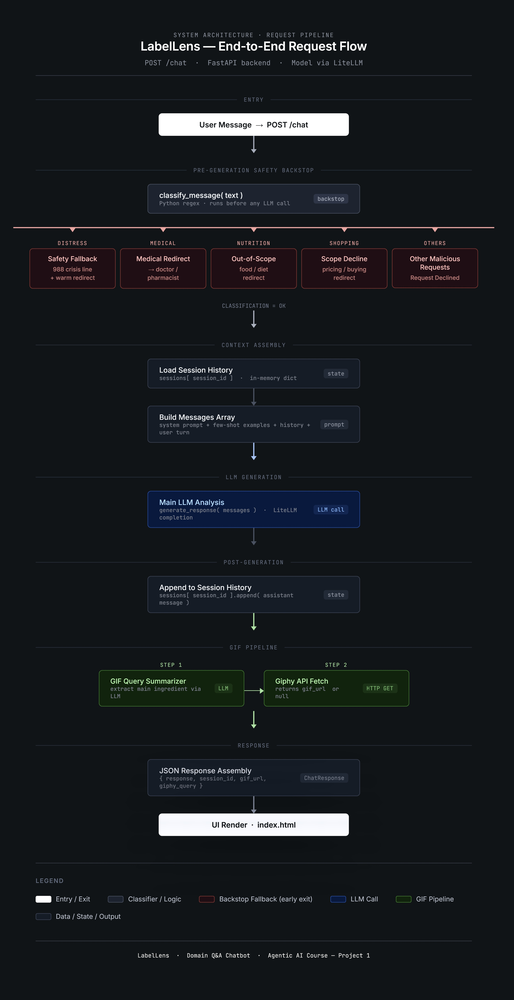
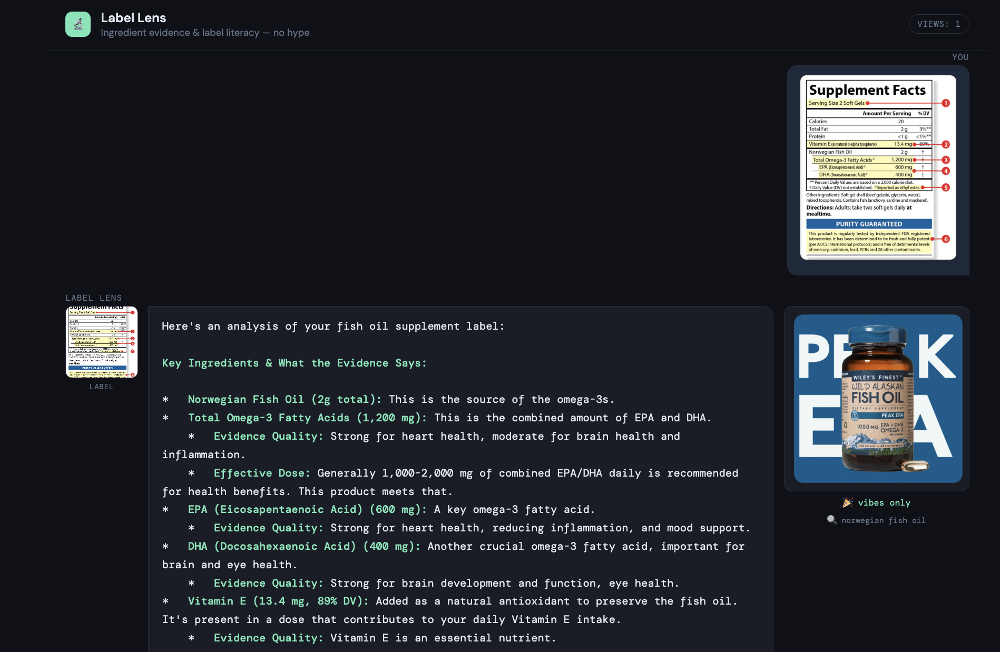

# Label Lens 🔬

A chatbot that decodes supplement labels and calls out marketing fluff — telling you what the evidence actually says about each ingredient. Supports both **text input** and **image upload** (photograph a label directly), plus a contextual reaction GIF.

**Live URL:** _https://label-lens-966650518000.us-central1.run.app/_

---

## What it does

Type a question, paste a label, or photograph a supplement tub. Label Lens:

- Rates evidence quality: **Strong / Moderate / Weak / No Evidence**
- Flags marketing language: proprietary blends, "clinically studied", pixie-dusting
- Compares label doses to research-backed effective doses
- Gives a plain-English verdict on whether a product is worth it
- Shows a tacky, vibes-only reaction GIF based on the main ingredient/topic

**Image input:** Click 📎 or drag-and-drop a photo. The LLM reads the label from the image directly. The UI shows upload preview + chat-row label preview (with fallback if browser rendering fails), and the right panel shows the matching tacky GIF vibe. You can then ask follow-up questions in the same session as plain text.

Out of scope: medical diagnoses/interactions, general diet planning, and shopping/pricing recommendations. A Python pre-backstop routes these categories before main analysis, and a light post-backstop filters unsafe medical-style output.

---

## Request flow

1. User sends text (optional image attached) to `/chat`.
2. Python **pre-backstop** classifies the message (`distress`, `medical`, `nutrition_or_diet`, `shopping_or_pricing`, `ok`).
3. If out-of-scope, app returns a category-specific redirect response and stops normal analysis.
4. If `ok`, app runs normal supplement analysis with the main LLM prompt.
5. Python **post-backstop** checks the generated output and overrides unsafe medical-style advice if detected.
6. App generates a short main-ingredient GIF query (2-3 words), fetches a GIF from Giphy, and returns final response payload.
7. Frontend renders the analysis, label preview/fallback, and GIF panel.


---

## Prerequisites

- Python 3.10+
- [uv](https://docs.astral.sh/uv/) — install with `curl -LsSf https://astral.sh/uv/install.sh | sh`
- A vision-capable model via LiteLLM (Gemini, GPT-4o, etc.)

---

## Environment configuration (`.env`)

Create/edit a `.env` file in the project root. These are the variables used by this repo:

```env
# Required for app runtime
MODEL=vertex_ai/gemini-2.5-flash-lite

# Optional for app runtime
GIPHY_API_KEY=your_giphy_api_key
LITELLM_API_BASE=
LITELLM_API_KEY=

# Optional for evals only (defaults to MODEL if unset)
JUDGE_MODEL=vertex_ai/gemini-2.5-flash-lite
```

Use `KEY=value` format with no quotes needed.
Do not commit real secrets in `.env`; keep it local and add `.env` to `.gitignore` if needed.

### Provider-specific notes

- **Vertex AI (default):**
  - Keep `MODEL=vertex_ai/gemini-2.5-flash-lite` (or another Vertex model)
  - Authenticate locally:
    ```bash
    gcloud auth application-default login
    gcloud config set project YOUR_PROJECT_ID
    ```
- **OpenAI via LiteLLM:**
  - Example:
    ```env
    MODEL=gpt-4o
    OPENAI_API_KEY=sk-...
    ```
  - `OPENAI_API_KEY` is consumed by LiteLLM/provider SDK, not directly in `app.py`.
- **Local Ollama via LiteLLM proxy:**
  - Example:
    ```env
    MODEL=ollama/llava
    LITELLM_API_BASE=http://localhost:11434
    ```

### Get a Giphy API key

1. Go to [developers.giphy.com](https://developers.giphy.com/) and sign in (or create an account).
2. Open the Developer Dashboard and create a new app.
3. Choose an API app type, give it a name, and submit.
4. Copy the generated API key from your app settings.
5. Add it to your local `.env`:
   ```env
   GIPHY_API_KEY=your_actual_key
   ```
6. For Cloud Run deployment, set the same key as a runtime env var:
   ```bash
   gcloud run services update label-lens \
     --region us-central1 \
     --update-env-vars GIPHY_API_KEY=YOUR_GIPHY_API_KEY
   ```

---

## Run locally

```bash
# 1. Install dependencies
uv sync

# 2. Start the server
uv run uvicorn app:app --reload
```

Open [http://localhost:8000](http://localhost:8000).

**Using image input:**
- Click 📎 or drag-and-drop an image onto the input area
- Type an optional question ("Is this worth buying?") and hit Decode
- Follow-up turns in the same session are text-only

---

## Current limits and safeguards

- **Max user message length:** 4000 characters (`/chat` returns `400` if exceeded)
- **Max image size:** 8 MB (checked in both frontend and backend; backend returns `413` if exceeded)
- **Image media type validation:** backend requires `image/*`
- **HEIC/HEIF handling:** frontend attempts automatic conversion to JPEG before upload
- **Preview fallback:** if browser cannot render preview image, UI shows `label attached`
- **Error handling:** internal LLM exceptions are logged server-side; users receive a generic retry message
- **Auth by default on deploy:** Cloud Run deploy config uses `--no-allow-unauthenticated`
- **Pre-backstop categories:** `distress`, `medical`, `nutrition_or_diet`, `shopping_or_pricing`
- **Post-backstop:** overrides unsafe medical-style output with a safe medical redirect
- **GIF query behavior:** generated from a short main-ingredient summary (2-3 words), then searched on Giphy
- **Visitor counter in UI:** shows unique visitors seen by this running app instance (cookie + in-memory counter)

### Chat output length behavior

- There is currently **no explicit `max_tokens`** set in backend model calls.
- There is currently **no backend/frontend hard truncation** of assistant responses.
- The prompt asks the model to keep responses at or below **2500 characters**, but this is an instruction (not a hard cap).

### Visitor counter behavior

- The `Views` badge in the header is tracked via cookie (`label_lens_visitor_id`) and server memory.
- The badge refreshes on page load and user actions (send/attach/remove).
- On Cloud Run, this count is **per running instance** and resets on restart/deploy.
- With multiple instances, each instance maintains its own count (not globally aggregated).

---

## Run evals

```bash
uv run pytest evals/ -v -s
```

| Suite | File | Method | Cases |
|---|---|---|---|
| Golden reference (MaaJ) | `test_golden.py` | LLM judge vs reference answer | 10 |
| Rubric (MaaJ) | `test_rubric.py` | LLM judge vs weighted rubric | 10 |
| Deterministic | `test_deterministic.py` | regex / keyword / classifier | 28 |

Run a single suite:
```bash
uv run pytest evals/test_golden.py -v -s
uv run pytest evals/test_rubric.py -v -s
uv run pytest evals/test_deterministic.py -v -s
```

> MaaJ evals make live LLM calls and incur API costs. Deterministic evals are nearly free.

### Step-by-step test run order (before push)

Run all commands from the project root:
 
1. Sync dependencies:
   ```bash
   uv sync
   ```
2. Run deterministic evals first (fast, no judge model):
   ```bash
   uv run pytest evals/test_deterministic.py -v -s
   ```
3. Run golden MaaJ evals:
   ```bash
   uv run pytest evals/test_golden.py -v -s
   ```
4. Run rubric MaaJ evals:
   ```bash
   uv run pytest evals/test_rubric.py -v -s
   ```
5. Final full-suite check:
   ```bash
   uv run pytest evals/ -v -s
   ```
  

---

## Eval dataset summary

| Category | Count | File |
|---|---|---|
| In-domain golden reference | 10 | `test_golden.py` |
| In-domain rubric quality | 5 | `test_rubric.py` |
| Out-of-scope (rubric) | 3 | `test_rubric.py` |
| Adversarial/safety (rubric) | 2 | `test_rubric.py` |
| Deterministic keyword checks | 5 | `test_deterministic.py` |
| Out-of-scope refusal detection | 5 | `test_deterministic.py` |
| Python backstop classifier | 12 | `test_deterministic.py` |
| Safety fallback quality | 2 | `test_deterministic.py` |
| Post-backstop output guard | 4 | `test_deterministic.py` |
| **Total** | **48** | |

---

## Repo structure

```
supplement-label-decoder/
├── app.py              # FastAPI: prompts, multimodal image handling, safety backstop
├── index.html          # Frontend: chat UI with image attach + drag-and-drop
├── Dockerfile          # Container build for Cloud Run
├── cloudbuild.yaml     # Cloud Build pipeline (build + push + Cloud Run deploy)
├── .gcloudignore       # Files excluded from Cloud Build upload
├── pyproject.toml      # uv-based dependencies
├── uv.lock             # Locked dependency graph used by uv/Docker build
├── .env                # Local runtime/eval environment variables
├── jailbreak_prompt_testing.md  # Manual jailbreak prompt bank
├── evals/
│   ├── conftest.py            # Shared fixtures
│   ├── test_golden.py         # 10 golden-reference MaaJ evals
│   ├── test_rubric.py         # 10 rubric MaaJ evals
│   └── test_deterministic.py  # Deterministic evals
└── README.md
```

---

## Deploy to Google Cloud Run (Cloud Build)

This repo is already set up for Cloud Run deployment with:

- `Dockerfile`
- `cloudbuild.yaml` (service/image name: `label-lens`)
- `.gcloudignore` (excludes `.env`, `.venv`, caches, `.git`)

### Prerequisites

- `gcloud` CLI installed
- A Google Cloud project with billing enabled
- Cloud Build and Cloud Run APIs enabled

### 1. Authenticate and select project

```bash
gcloud auth login
gcloud config set project YOUR_PROJECT_ID
```

### 2. Enable required APIs

```bash
gcloud services enable cloudbuild.googleapis.com run.googleapis.com
```

### 3. Build and deploy

Run this from the project root:

```bash
gcloud builds submit .
```

This uses `cloudbuild.yaml` to:
1. Build image `gcr.io/$PROJECT_ID/label-lens`
2. Push image to Container Registry
3. Deploy Cloud Run service `label-lens` in `us-central1`

### 4. Set runtime environment variables (MODEL + GIPHY)

Cloud Build deploy does not automatically include your local `.env` values.
If you still need a key, see **Get a Giphy API key** above.
Set/update runtime env vars explicitly:

```bash
gcloud run services update label-lens \
  --region us-central1 \
  --update-env-vars MODEL=vertex_ai/gemini-2.5-flash-lite,GIPHY_API_KEY=YOUR_GIPHY_API_KEY
```

### 5. Verify env vars on the deployed service

```bash
gcloud run services describe label-lens \
  --region us-central1 \
  --format="yaml(spec.template.spec.containers[0].env)"
```

### 6. Access control options

`cloudbuild.yaml` currently deploys with `--no-allow-unauthenticated` (private/auth-required URL).

To restrict access to Columbia users only:

```bash
gcloud run services remove-iam-policy-binding label-lens \
  --region us-central1 \
  --member=allUsers \
  --role=roles/run.invoker

gcloud run services add-iam-policy-binding label-lens \
  --region us-central1 \
  --member=domain:columbia.edu \
  --role=roles/run.invoker
```

You can do the same from Cloud Run Console -> Service -> Security tab.

### 7. Get the service URL

```bash
gcloud run services describe label-lens \
  --region us-central1 \
  --format='value(status.url)'
```

### Notes

- `.env` is excluded by `.gcloudignore`, so it is not uploaded during `gcloud builds submit .`.
- For Vertex AI calls from Cloud Run, ensure the service account used by Cloud Run has `Vertex AI User` (`roles/aiplatform.user`).

---

## Prompt design

- **Persona:** Label Lens — evidence-first, calls out marketing, plain English
- **Few-shot examples (3):** Proprietary blend decode, creatine question, enzyme blend claim
- **Positive constraints:** Lists exactly what it can answer
- **Escape hatch:** "The evidence is limited — check Examine.com or PubMed"
- **Out-of-scope routing categories (pre-backstop):** Distress, medical, nutrition/diet planning, shopping/pricing
- **Jailbreak-aware medical routing:** catches instruction-override patterns, lab/biomarker protocol prompts, and routes them to medical refusal
- **Python pre-backstop:** `classify_message()` routes out-of-scope categories before normal analysis
- **Python post-backstop:** `apply_post_backstop()` overrides unsafe medical-style output if it slips through
- **Manual adversarial prompt bank:** `jailbreak_prompt_testing.md` for reproducible jailbreak checks

## Result
